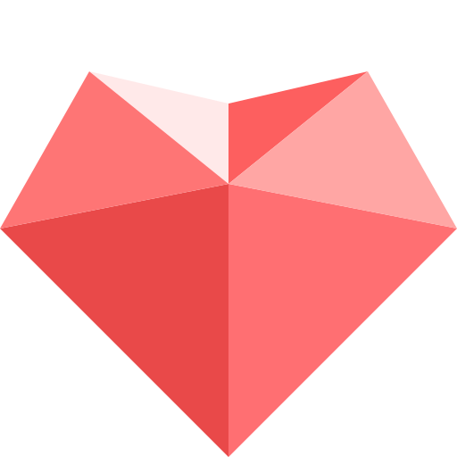
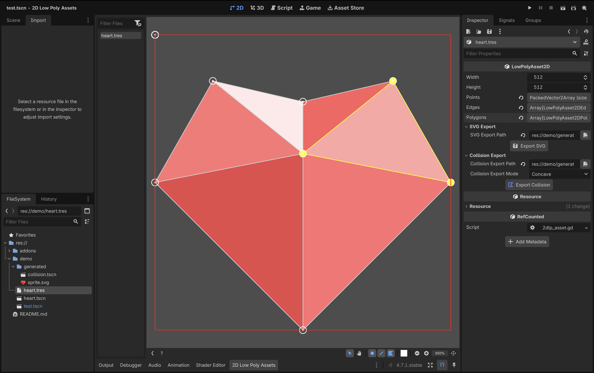

# 2D Low Poly Assets

<p align="center">
  
</p>

Create low-poly 2D artwork directly in the Godot editor, then export it as SVG artwork or reusable 2D collision geometry.



## Features

- Create artwork from points, edges, and colored polygons.
- Select, move, rotate, link, and remove points with undo/redo support.
- Box-select multiple points and constrain movement to one axis.
- Pan and zoom around the editing canvas.
- Toggle point, edge, and polygon visibility.
- Export scalable SVG artwork with polygon colors and transparency.
- Export a centered `CollisionPolygon2D` scene for static or dynamic physics bodies.

## Requirements

The plugin is developed and tested with Godot 4.7.1. Earlier Godot versions are not currently supported unless explicitly tested.

## Installation

1. Download the repository archive for the version you want to install.
2. Copy the `addons/2dlp` directory into your Godot project's `addons` directory:

   ```text
   your_project/
   └── addons/
       └── 2dlp/
           ├── plugin.cfg
           └── ...
   ```

3. Open your project in Godot.
4. Open **Project > Project Settings > Plugins**.
5. Enable **2D Low Poly Assets**.

## Quick start

1. In the FileSystem dock, create a new `LowPolyAsset2D` resource and save it as a `.tres` file.
2. Select the resource. The **2D Low Poly Assets** dock opens at the bottom of the editor.
3. Set the resource's `Width` and `Height` to define the editing canvas.
4. Press <kbd>A</kbd> to add points at the cursor.
5. Select two or more points and press <kbd>L</kbd> to link them. Linking three or more points closes the shape and creates a colored polygon.
6. Choose the polygon color from the toolbar before creating a polygon.
7. Save the resource normally when finished.

The file list on the left side of the dock keeps track of resources opened during the current editor session. Use its filter to find an open resource by filename.

## Controls

| Action | Control |
| --- | --- |
| Add a point | <kbd>A</kbd> |
| Select a point | Left-click |
| Add or remove a point from the selection | <kbd>Shift</kbd> + left-click |
| Box-select points | Left-drag |
| Add points with box selection | <kbd>Shift</kbd> + left-drag |
| Remove selected points | <kbd>Backspace</kbd> |
| Link selected points | <kbd>L</kbd> |
| Move selected points | <kbd>M</kbd> |
| Rotate selected points | <kbd>R</kbd> |
| Pan in Select mode | Right-drag |
| Pan in Pan mode | Left-drag or right-drag |
| Zoom | Mouse wheel or toolbar buttons |
| Confirm a move or rotation | <kbd>Enter</kbd> or left-click |
| Cancel a move or rotation | <kbd>Escape</kbd> or right-click |

While moving points, press <kbd>X</kbd> or <kbd>Y</kbd> to constrain movement to that axis. You can then type a number to enter an exact offset. While rotating, type a number to enter an exact angle in degrees.

## Exporting SVG artwork

1. Select the `LowPolyAsset2D` resource.
2. Under **SVG Export** in the Inspector, choose an `.svg` output path.
3. Click **Export SVG**.

The exported SVG uses the resource width and height as its canvas and preserves each polygon's color and alpha value.

## Exporting collision geometry

1. Under **Collision Export** in the Inspector, choose a `.tscn` output path.
2. Select a collision export mode:

   - **Concave** attempts to merge the artwork's polygons into their combined outline.
   - **Convex** generates a convex hull around all polygon vertices.

3. Click **Export Collision**.

Collision export requires exactly one resulting polygon. Export fails with an invalid-data error if the artwork is empty or if concave merging leaves multiple disconnected polygons. Use **Convex** mode when a single convex hull is appropriate.

The resulting scene has a `CollisionPolygon2D` root centered around the middle of the asset canvas. Instance it directly beneath a compatible `CollisionObject2D`, for example:

```text
RigidBody2D
├── Sprite2D
└── LowPolyCollision  # Instanced exported CollisionPolygon2D scene
```

The same exported scene can be used beneath `StaticBody2D`, `RigidBody2D`, `CharacterBody2D`, or `Area2D` nodes.

## Demo

Open this repository as a Godot project and run `demo/test.tscn`. The demo uses the included heart asset, exported SVG, and exported collision scene with `RigidBody2D` instances.

## License

2D Low Poly Assets is available under the [MIT License](LICENSE).

Issues and contributions are welcome through the [GitHub repository](https://github.com/Kraddle-Studio/2d-low-poly-godot).
